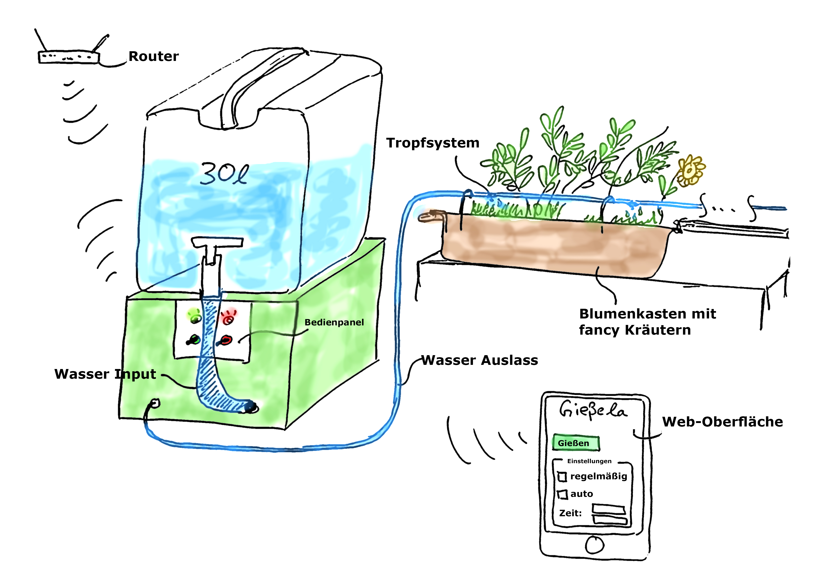
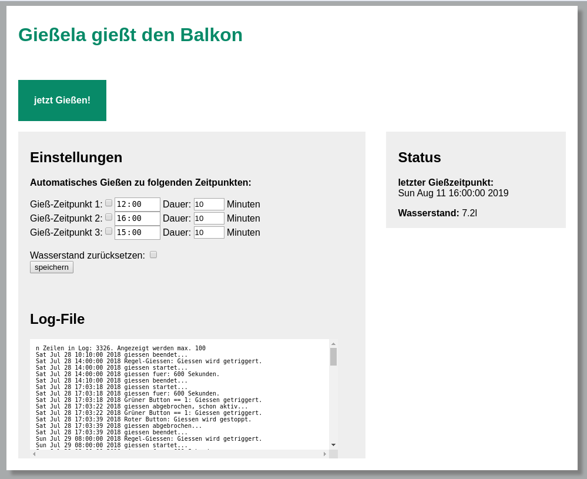

# Gißela
**Automates watering the balcony plants** 
This repostiroy holds the source code for the raspberrry pi controlling the watering system and the code for the webinerface to interact with the system. One can choose to start watering up to three times a days for a duration of 60 min in total. Manual enabling is possible via buttons or the webinterface.
Additionally, one can add an gmail-address and send a *magic email* to the system, which triggers the watering. By using the mail interface, one can easily control from outside the home-network.

## Software

### Control Software
* C++ written, multithreading to control the waterpump and polling buttons
* watches for *magic email*
* keeps track of used water by integrating a fixed rate over time
* unix-sockets deal with the communication to the php backend of the webinterface.

### Webinterface to adjust Gißela
Simple HTML-based interface to control the gisela system. Runs also on the raspberry via apache2 webserver.

## Hardware
* Raspberrypi zero
* 30l water canister
* wooden housing
* hose and dripper from hardware store
